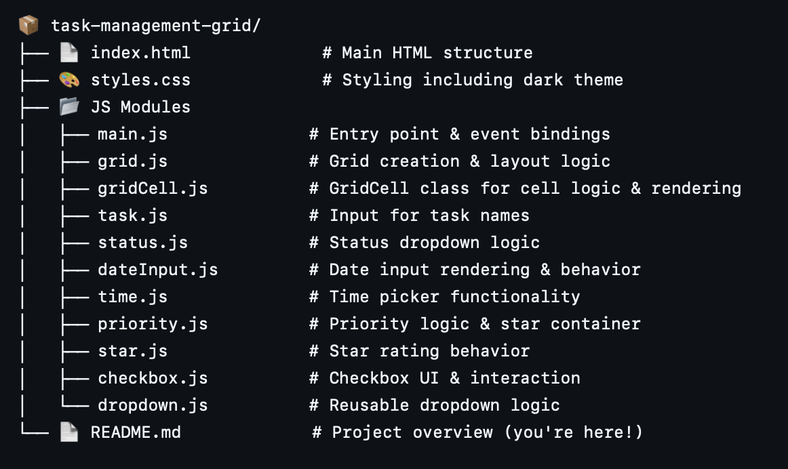
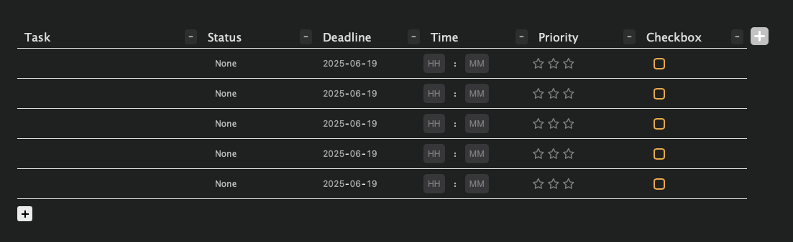

🗂️ Task Management Grid App

A modular, dynamic task management tool built with vanilla JavaScript, HTML, and CSS. This app provides an interactive, grid-based interface for organizing and tracking tasks by customizable attributes such as Task name, Status, Deadline, Time, Priority, and Completion.

Modern, dark-mode UI with editable, structured task data.

🧩 Features

🧱 Dynamic Grid Layout
Add or remove rows (tasks) and columns (task attributes) easily.
🔧 Modular Architecture
Each core functionality (e.g., date input, star ratings, dropdowns) is implemented in its own JavaScript module for clarity and scalability.
🎨 Dark Mode Design
Clean, modern UI that’s easy on the eyes.
🖱️ Interactive Components
Status dropdown
Date selector (YYYY-MM-DD)
Time picker (HH:MM)
Star-based priority rating
Completion checkbox
🧠 Object-Oriented Codebase
Uses classes and clean separation of concerns for maintainability.

---

📁 Project Structure

--- 

📸 Preview

---

🧠 How It Works

Each row represents a task.
Each column represents an attribute (Task, Status, Deadline, Time, Priority, Checkbox).
A "+" button adds a new row; columns can also be added or removed dynamically.
Each cell is an instance of the GridCell class, styled and populated based on its type.
Separate modules manage their own DOM elements and logic (e.g., priority.js creates the star rating, checkbox.js manages completion state, etc.).

---

🛠️ Tech Stack

HTML / CSS – Layout and styling
JavaScript (Vanilla) – Logic, user interaction
Object-Oriented Programming – Clean, modular code with methods and states

---

📚 What I Learned

- DOM manipulation (createElement, appendChild, querySelectorAll)
- JavaScript Object-Oriented Programming
- Modular programming and file separation
- Dynamic styling and component-based design without a framework
- Handling date, time, and input states manually

---
🚀 live Demo

[click here](https://minooshvejdani.github.io/task-management/)

---

🔮 Future Improvements

✅ Task saving using localStorage
🔄 Drag-and-drop reordering
📝 Inline editing for titles

---

MIT License

Copyright (c) 2025 Your Name

Permission is hereby granted, free of charge, to any person obtaining a copy of this software and associated documentation files (the "Software"), to deal in the Software without restriction...